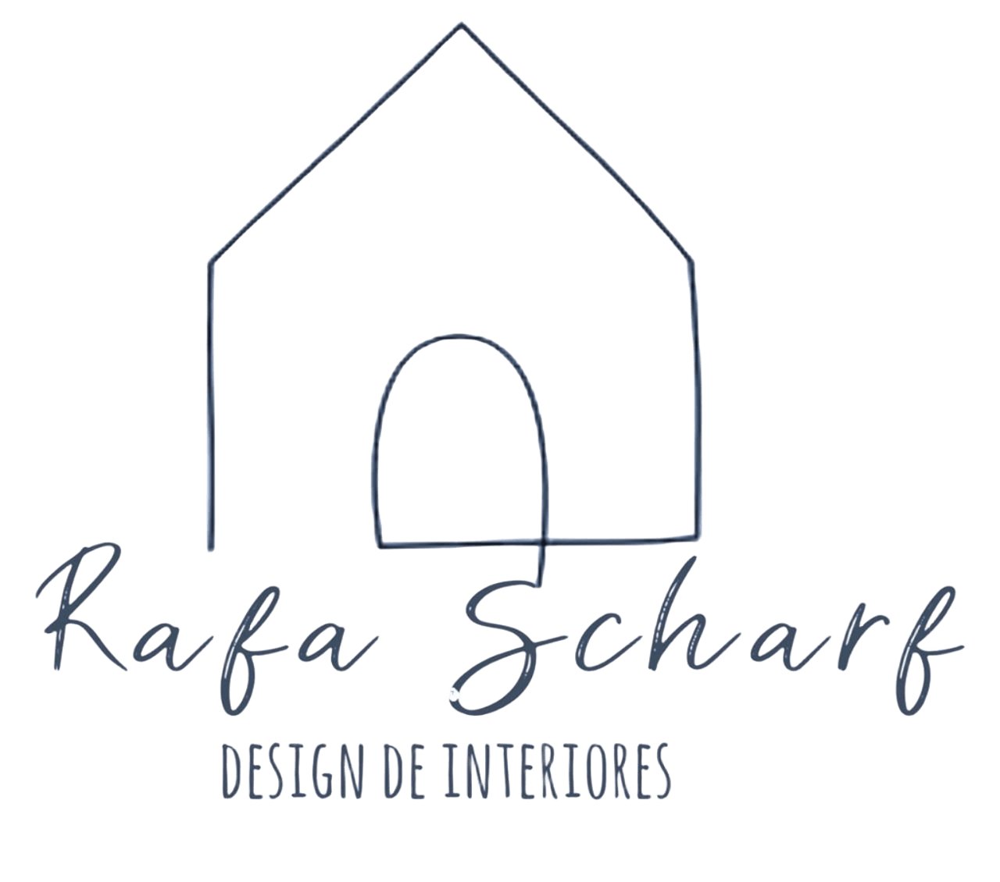
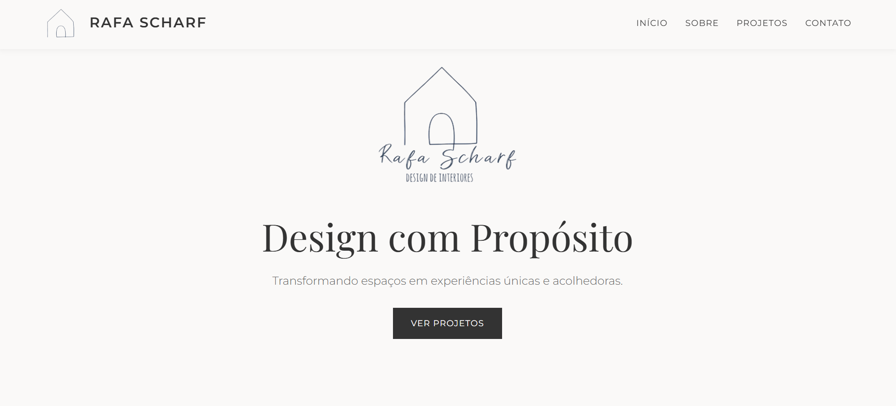

<h1 align="center">
  
  <br>
  🎨 Rafa Scharf | Design de Interiores
</h1>

<p align="center">
  Site de portfólio elegante e responsivo desenvolvido para apresentar os projetos da designer de interiores Rafa Scharf.
</p>

### 🌐 Acesso Online
[](https://rafaelascharfdesign.netlify.app/)

---

## 📸 Visualização do Projeto



---

## ✨ Funcionalidades

- [x] **Menu de navegação fixo** com logo responsiva.
- [x] **Layout Minimalista:** Design clean que valoriza as fotos dos projetos.
- [x] **Carrossel Interativo:** Navegação dinâmica entre os projetos recentes.
- [x] **Seção Sobre:** Apresentação profissional da designer com foto.
- [x] **Design Responsivo:** Adaptável para Desktop, Tablets e Celulares.
- [x] **Links de Contato:** Botões diretos para WhatsApp, E-mail e Instagram.

---

## 🛠 Tecnologias Utilizadas

Este projeto foi desenvolvido com as seguintes tecnologias:

*  **HTML5**
*  **CSS3**
*  **JavaScript**
* **Fontes Google**: Montserrat e Playfair Display.

---

## 📁 Estrutura de Pastas

```bash
portfolio-rafa-scharf
│
├── index.html          # Arquivo principal
├── img/                # Imagens do projeto e logos
│   ├── logo.png
│   ├── logo_fundo.png
│   ├── rafa.jpeg
│   ├── img_1.jpeg
│   ├── img_7.jpeg
│   ├── img_8.jpeg
│   ├── img_9.jpeg
│   ├── img_10.jpeg
│   └── preview-site.png
└── README.md

```

---

## 🚀 Como executar o projeto localmente

1. **Clone o repositório:**
```bash
git clone https://github.com/Renata5207418/portfolio-rafa-scharf.git

```


2. **Acesse a pasta:**
Entre na pasta do projeto clonado.
3. **Abra o site:**
Dê um duplo clique no arquivo `index.html` ou use uma extensão como "Live Server" no VS Code.

---

👩‍🎨 Designer & Cliente:
>  Rafa Scharf | Design de Interiores

👩‍💻 Desenvolvido por:
> Renata Scharf
